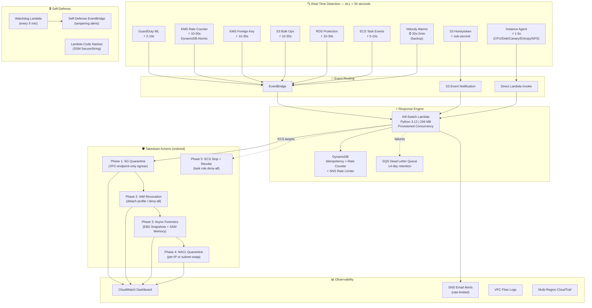
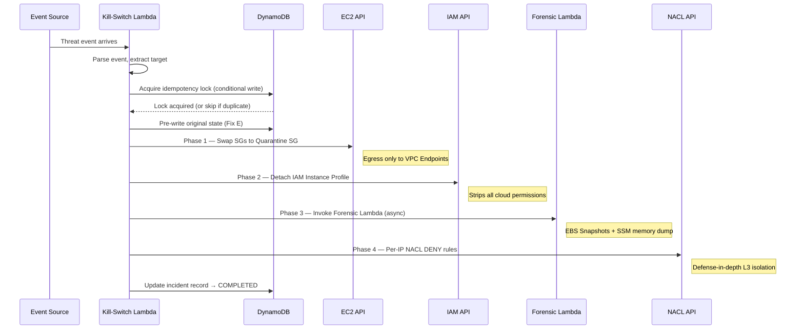

# CloudFreeze v7: Autonomous Ransomware Defense for AWS

> **Authors:** Aswin R & Vaishnavi SS Nyshadham
> **Version:** 7.0 — State-of-the-Art Edition
> **Runtime:** Python 3.12 | Terraform ≥ 1.3 | AWS Provider ~> 5.0
> **License:** Proprietary | Academic Research

---

## What Is CloudFreeze?

CloudFreeze is a **fully autonomous, zero-human-intervention** ransomware defense system built natively on AWS. It detects threats in **under 30 seconds** across 9 independent detection channels and neutralizes them by executing a multi-layered quarantine — network isolation, IAM revocation, NACL lockdown, and forensic evidence preservation — all without any human approval step.

Unlike traditional SIEM-driven playbooks that require SOC analyst triage (20–45 minutes mean response), CloudFreeze reduces detection-to-containment to **< 30 seconds end-to-end**, limiting the attack blast radius to at most a handful of encrypted files rather than entire filesystems or S3 buckets.

---

## Architecture Overview



### Why This Architecture?

| Design Decision | Rationale | Impact |
|---|---|---|
| **EventBridge over polling** | Native AWS event bus delivers CloudTrail events in 10-30s (vs 5-15 min for CloudWatch metric pipelines) | **10× faster KMS detection** |
| **S3 Event Notification for honeytokens** | Bypasses CloudTrail entirely; fires directly on S3 access | **Sub-second honeytoken response** |
| **On-instance agent via systemd** | Reads `/proc/diskstats` and `top` directly; invokes Lambda via SDK | **1-5s** detection vs 30s-2min for CloudWatch alarms |
| **DynamoDB atomic counters** | `UpdateItem` with `ADD` is atomic — no race conditions across concurrent Lambdas | **Zero duplicate quarantines** under load |
| **Async forensic Lambda** | Decouples slow snapshot creation (up to 300s) from quarantine path (< 60s) | **Quarantine is never blocked** by forensics |
| **Per-IP NACL deny rules** | When multiple instances share a subnet, only the compromised IP is blocked | **Zero blast radius** to healthy neighbors |
| **Circuit breaker pattern** | Trips after 5 consecutive API failures; defers remaining actions | **Prevents "API hurricane"** during mass attacks |
| **Provisioned concurrency** | One warm Lambda container always ready | **Eliminates cold start** (< 1ms init instead of 500ms-3s) |
| **Two-layer idempotency** | In-memory cache (per-container) + DynamoDB conditional write (distributed) | **Robust dedup** even during DynamoDB outages |
| **Fail-open on DDB failure** | If DynamoDB is deleted, quarantine proceeds with in-memory fallback | **Security > deduplication** — always quarantine when in doubt |

---

## Detection Channels — Complete Breakdown

### Channel Latency Table

| # | Channel | Latency | Mechanism | Why This Channel Exists |
|---|---------|---------|-----------|-------------------------|
| 1 | **S3 Honeytoken** | **< 1 second** | S3 Event Notification → Lambda | Fastest possible trap — attacker touches decoy credentials file, immediate lockdown |
| 2 | **Instance Agent** | **1-5 seconds** | systemd agent → Direct Lambda invoke | OS-level detection: CPU spikes, disk I/O surges, canary file tampering, Shannon entropy analysis, NFS mount changes |
| 3 | **GuardDuty ML** | **2-10 seconds** | AWS ML models → EventBridge → Lambda | Catches recon, unauthorized access, crypto-mining, trojans — ML-based patterns humans can't write rules for |
| 4 | **KMS Rate Counter** | **10-30 seconds** | EventBridge CloudTrail → Lambda → DynamoDB atomic counter | Detects mass encryption via KMS; threshold-based with distributed counting |
| 5 | **KMS Foreign Key** | **10-30 seconds** | EventBridge CloudTrail → Lambda | Catches attacker using their own KMS key (cross-account key hijack) |
| 6 | **S3 Bulk Ops** | **10-30 seconds** | EventBridge CloudTrail → Lambda → DynamoDB rate counter | Detects S3-layer ransomware (mass DeleteObject/PutObject) |
| 7 | **RDS Protection** | **10-30 seconds** | EventBridge CloudTrail → Lambda | Catches database-layer attacks: DeleteDBInstance, ModifyDBInstance, snapshot exports |
| 8 | **ECS Task Events** | **5-15 seconds** | EventBridge ECS events → Lambda | Catches containerized threats: suspicious ECS tasks, abnormal exit codes |
| 9 | **Velocity Alarms** | **30s-2 min** | CloudWatch Alarms → EventBridge → Lambda | Backup: CW alarm-based CPU & disk thresholds (secondary to instance agent) |

### Why 9 Channels Instead of 1?

The multi-channel design ensures **defense-in-depth for detection**:

- **No single point of detection failure.** If ransomware kills the SSM agent (channel 2), GuardDuty ML (channel 3) and KMS counters (channel 4) still detect.
- **Different attack vectors have different observables.** S3-layer ransomware (channel 6) looks nothing like EC2 disk encryption (channel 2/4).
- **Sub-second response for the most common initial access.** Honeytokens (channel 1) catch credential theft before any encryption begins.

---

## Takedown Actions — Execution Order & Rationale

When the Kill-Switch Lambda fires, it executes a **strict 5-phase ordered takedown**:



| Phase | Action | Why This Order | What It Blocks |
|-------|--------|----------------|----------------|
| **1. SG Quarantine** | Replace all ENI SGs with quarantine SG | Fastest API call; allows VPC endpoint egress for SSM/CW | All inbound traffic; outbound except HTTPS to VPC endpoints |
| **2. IAM Revocation** | Detach Instance Profile | Strips cloud API permissions; instance can no longer call KMS/S3 | All AWS API calls from the instance |
| **3. Async Forensics** | Invoke forensic Lambda (async) | Needs SSM connectivity (still available via VPC endpoints after Phase 1) | Nothing — forensics is non-blocking |
| **4. NACL Quarantine** | Add per-IP DENY rules (or swap NACL) | Must be AFTER forensics — NACL blocks VPC endpoint traffic too | Everything including L3 network — total isolation |
| **5. ECS Takedown** | Stop ECS task + deny-all on task role | For container targets only | All ECS task execution + API access |

### Why Pre-Write Original State? (Fix E)

If Lambda crashes between Phase 1 and Phase 4, the instance is partially quarantined but the incident record may not have the original SG configuration. **Fix E saves original SGs/subnet to DynamoDB _before_ any modifications**, ensuring the Restore Lambda can always recover.

---

## Edge Case Handling — 33 Fixes Across 7 Versions

CloudFreeze handles **20+ documented edge cases** that would cause simpler systems to fail:

| Edge Case | What Goes Wrong Without It | CloudFreeze Fix |
|-----------|---------------------------|-----------------|
| **Terminated instance** | EC2 API returns 400 error, Lambda crashes | Instance state validation before quarantine (skip terminated) |
| **Malformed instance ID** | API throws `InvalidInstanceID.Malformed` | Explicit error code handling, graceful return |
| **No ENIs on instance** | `ModifyNetworkInterfaceAttribute` fails | Warning logged, empty ENI list handled |
| **Quarantine SG deleted** | SG swap fails silently | Pre-check SG existence; alert if missing |
| **DynamoDB unavailable** | Duplicate quarantines or no quarantine at all | Two-layer dedup: in-memory cache (per-container) + DDB conditional write. Fail-open: proceed if DDB is down |
| **DynamoDB table deleted by attacker** | Idempotency and rate counting completely disabled | Cold-start health check detects missing tables, sends CRITICAL alert, operates in degraded mode |
| **KMS rate check race condition** | Two Lambdas read-then-write, both seeing below-threshold | DynamoDB `UpdateItem` with `ADD` is atomically guaranteed |
| **Multiple instances in same subnet** | NACL swap quarantines ALL instances in the subnet | Per-IP NACL deny rules (SHA256 hash + linear probing for 200-slot collision avoidance) |
| **SSM agent killed by ransomware** | Memory forensics command fails | SSM health check before issuing commands; graceful skip with documented gap |
| **Alert flood during mass attack** | 50+ SNS emails in 5 minutes | SNS rate limiter: max 10 individual alerts per 5-min window, then summary mode |
| **API throttling during mass quarantine** | Lambda retries hammer throttled API endlessly | Circuit breaker: trips after 5 failures, defers remaining actions |
| **Cold start latency** | First invocation takes 500ms-3s | Provisioned concurrency: 1 warm container always ready |
| **Cross-region attack** | Lambda can't quarantine instance in different region | Cross-region EC2 client pool with caching |
| **IAM permissions tampered** | Lambda silently fails to quarantine | Cold-start IAM validation: verifies `DescribeInstances` + `DescribeSecurityGroups`, sends CRITICAL SNS if degraded |
| **EventBridge rules disabled by attacker** | Detection pipeline silently broken | Self-defense watchdog (every 5 min) verifies rules, auto-re-enables disabled rules |
| **Lambda code modified by attacker** | Kill-switch logic neutered | Watchdog verifies Lambda SHA256 code hash against SSM SecureString store |
| **Non-KMS local encryption (OpenSSL, GPG)** | Bypasses all KMS-based detection | Instance agent monitors Shannon entropy of new files; detects `.enc`, `.locked`, `.crypted` extensions |
| **Slow/low-and-slow encryption** | Below per-minute rate threshold | File change rate monitoring via `inotify` — detects sustained modification patterns |
| **Attacker mounts attacker-controlled NFS** | Data exfiltration via network filesystem | NFS/EFS/CIFS mount change detection at OS level |
| **Monitoring agent killed by `kill -9`** | No more CPU/disk/canary detection | systemd `Restart=always` + independent watchdog service that re-starts agent within 10s |
| **Monitoring script tampered** | Agent logic compromised | `chattr +i` (immutable attribute) on script; watchdog re-applies every 10s |
| **Canary checksums tampered on disk** | Attacker replaces checksums alongside files | Checksums stored in SSM Parameter Store (off-instance, tamper-proof) |
| **ECS task stopped but role still active** | Remaining sessions can still make API calls | deny-all policy applied to ECS task role after stopping the task |
| **S3-layer ransomware (mass delete)** | No detection if only S3 objects are destroyed | S3 bulk operation EventBridge rule with per-principal rate counting |
| **RDS database deletion** | Database destroyed with no defense | RDS protection EventBridge rule catches DeleteDBInstance/DeleteDBCluster |

---

## Cost Analysis

### Monthly Cost Breakdown (us-east-1, single instance)

| Resource | Configuration | Monthly Cost | Why Included |
|----------|--------------|-------------|--------------|
| **EC2 t2.micro** | 1 instance, 8GB gp3 EBS | ~$8.50 | Monitored target instance |
| **Lambda Kill-Switch** | 256MB, provisioned concurrency × 1 | ~$3.50 | Provisioned = ~$1.50/mo, invocations negligible |
| **Lambda Forensic** | 256MB, on-demand | ~$0.01 | Only fires during incidents |
| **Lambda Restore** | 256MB, on-demand | ~$0.01 | Only fires during manual restore |
| **Lambda Watchdog** | 128MB, every 5 min (8,640/mo) | ~$0.10 | Integrity scan overhead |
| **DynamoDB (2 tables)** | PAY_PER_REQUEST | ~$0.25 | Idle tables nearly free; TTL auto-cleans |
| **S3 Honeytoken Bucket** | 1 decoy file, versioning | ~$0.01 | < 1KB storage |
| **S3 CloudTrail Logs** | ~2-5 GB/mo typical | ~$0.12 | Lifecycle → Glacier @ 90 days |
| **S3 Forensic Data** | Empty until incident | ~$0.00 | Lifecycle → Glacier @ 30 days, expire @ 365 days |
| **CloudTrail** | Multi-region, management + S3 data events | ~$2.00 | First trail free; data events = $0.10/100K |
| **GuardDuty** | ML analysis of VPC/DNS/S3 logs | ~$4.00 | Volume-dependent; minimal for single instance |
| **VPC Endpoints (6)** | 3× SSM, 2× CloudWatch, 1× S3 Gateway | ~$7.20 | Interface endpoints = $0.01/hr each; S3 Gateway is free |
| **SNS** | Email notifications | ~$0.00 | Free tier covers most usage |
| **CloudWatch** | Dashboard + 10 alarms + custom metrics | ~$3.00 | Dashboard = $3/mo; alarms = $0.10 each |
| **SQS (4 DLQs)** | Dead-letter queues | ~$0.00 | Free tier |
| **KMS** | 1 CMK with automatic rotation | ~$1.00 | $1/mo per key |
| **SSM Parameters** | 2 SecureString parameters | ~$0.00 | Free for standard tier |
| **Total** | | **~$29-30/mo** | |

### Cost at Scale

| Scale | Instances | Estimated Monthly | Notes |
|-------|-----------|-------------------|-------|
| Dev/Test | 1 | ~$30 | Current default deployment |
| Small Production | 5 | ~$45 | Same control plane; EC2 cost scales |
| Medium Production | 20 | ~$90 | GuardDuty and CloudTrail scale with volume |
| Enterprise | 100+ | ~$300+ | Consider reserved capacity for Lambda |

### Cost Optimization Strategies

1. **Remove provisioned concurrency** (saves $1.50/mo) — acceptable if 500ms cold start is tolerable
2. **Use S3 Gateway endpoint only** (saves $7.20/mo) — lose SSM Session Manager access during quarantine
3. **Disable GuardDuty** if already enabled account-wide (saves $4/mo) — use `enable_guardduty = false`
4. **Reduce watchdog frequency** to 15 min (saves ~$0.07/mo) — increases tampering detection gap

---

## Real-Time Performance Characteristics

### Latency Budget: From Event to Full Quarantine

```
╔══════════════════════════════════════════════════════════════════╗
║  HONEYTOKEN PATH (best case): < 3 seconds total                 ║
║  ├── S3 Event Notification delivery ........... < 200ms         ║
║  ├── Lambda cold start (provisioned) ........... < 1ms          ║
║  ├── Event parsing + target extraction ......... ~10ms          ║
║  ├── DynamoDB conditional write (idempotency) .. ~15ms          ║
║  ├── EC2 ModifyNetworkInterface (SG swap) ...... ~800ms         ║
║  ├── EC2 DisassociateIamInstanceProfile ........ ~500ms         ║
║  ├── Lambda Invoke (async forensics) ........... ~50ms          ║
║  └── EC2 CreateNetworkAclEntry (per-IP NACL) ... ~600ms         ║
║                                                                  ║
║  KMS RATE PATH (typical): 15-35 seconds total                   ║
║  ├── CloudTrail event delivery via EventBridge . 10-30s         ║
║  ├── Lambda execution .......................... ~2-5s          ║
║  └── (Same quarantine actions as above) ........ ~2s            ║
║                                                                  ║
║  INSTANCE AGENT PATH: 6-10 seconds total                        ║
║  ├── Agent check interval ...................... 5s              ║
║  ├── Direct Lambda invoke ...................... ~100ms          ║
║  └── (Same quarantine actions as above) ........ ~2s            ║
╚══════════════════════════════════════════════════════════════════╝
```

### Throughput and Concurrency

| Metric | Value | How Achieved |
|--------|-------|-------------|
| Max concurrent quarantines | **50** | Reserved concurrent executions on Kill-Switch Lambda |
| Provisioned warm containers | **1** | Zero cold start for first invocation |
| DynamoDB write throughput | **Unlimited** | PAY_PER_REQUEST auto-scales |
| SNS notification rate | **10/5 min** then summary | DynamoDB-based aggregate rate limiter |
| Circuit breaker threshold | **5 failures** | Trips after 5 consecutive API errors, defers remaining |
| Retry strategy | **5 retries, exponential backoff + full jitter** | AWS-recommended thundering herd prevention |

---

## How CloudFreeze Handles Advanced Ransomware

### Scenario 1: Classic Ransomware (KMS-based encryption)
**Attack:** Compromised EC2 role calls `kms:Encrypt` rapidly to encrypt files.
**Detection:** KMS Rate Counter (Channel 4) — DynamoDB atomic counter exceeds threshold within 10-30s.
**Response:** Full 4-phase quarantine. Forensic snapshots preserve pre-encryption state if snapshots complete before full volume encryption.

### Scenario 2: Non-KMS Local Encryption (OpenSSL, GPG)
**Attack:** Attacker uses `openssl enc` or `gpg` to encrypt files locally, bypassing AWS API monitoring entirely.
**Detection:** Instance Agent (Channel 2) — Shannon entropy analysis detects high-entropy output files (> 7.9 bits/byte). File extension monitoring catches `.enc`, `.locked`, `.crypted`. File change rate monitoring detects sustained rapid modifications via `inotify`.
**Response:** Agent invokes Lambda directly (1-5s). Full quarantine.

### Scenario 3: S3-Layer Data Destruction
**Attack:** Attacker calls `DeleteObject` or `PutObject` (overwrite) on thousands of S3 objects.
**Detection:** S3 Bulk Ops (Channel 6) — EventBridge rule catches every `DeleteObject`/`PutObject`, Lambda performs per-principal rate counting.
**Response:** IAM identity takedown (deny-all policy on the calling role/user).

### Scenario 4: Credential Theft → Honeytoken Access
**Attack:** Attacker exfiltrates credentials, then uses them to browse S3 looking for valuable data.
**Detection:** S3 Honeytoken (Channel 1) — decoy file `000_database_passwords.csv` is accessed. S3 Event Notification fires in < 1 second.
**Response:** Principal resolved → if EC2 role, full instance quarantine. If IAM user, deny-all inline policy + session revocation.

### Scenario 5: Defense Evasion (Disabling CloudFreeze)
**Attack:** Attacker disables EventBridge rules, deletes DynamoDB tables, modifies Lambda code.
**Detection:** Self-Defense Watchdog (every 5 min) checks: EventBridge rules enabled, Lambda code hash matches SSM store, DynamoDB tables ACTIVE, quarantine SG exists, IAM permissions intact. Self-Defense EventBridge rule catches `DisableRule`/`DeleteRule` API calls in real-time.
**Response:** Auto-remediation (re-enable rules). CRITICAL SNS alert to SecOps.

### Scenario 6: Container-Based Attack (ECS)
**Attack:** Compromised ECS task running malicious workload.
**Detection:** ECS Task Events (Channel 8) via EventBridge, or GuardDuty (Channel 3).
**Response:** ECS task stopped + task IAM role revoked with deny-all policy.

---

## Repository Structure

```
CloudFreeze/
├── lambda/                          # Serverless response engine (Python 3.12)
│   ├── lambda_function.py           # Kill-Switch — 1,907 lines (core quarantine logic)
│   ├── lambda_forensic.py           # Async Forensic — 286 lines (EBS snapshots + SSM memory)
│   ├── lambda_restore.py            # Rollback — 397 lines (un-quarantine with edge cases)
│   ├── lambda_watchdog.py           # Self-Defense — 407 lines (infrastructure integrity)
│   └── utils.py                     # Shared — 319 lines (retry, circuit breaker, NACL hash, entropy)
│
├── tests/                           # Zero-cost pytest + moto test suite
│   ├── test_lambda_function.py      # Kill-Switch tests (71,546 bytes)
│   ├── test_lambda_forensic.py      # Forensic tests
│   ├── test_lambda_restore.py       # Restore tests
│   ├── test_lambda_watchdog.py      # Watchdog tests
│   ├── test_killswitch_coverage.py  # Extended coverage tests
│   └── test_full_coverage.py        # Full integration coverage
│
├── main.tf                          # Terraform IaC — 2,680 lines (~70+ AWS resources)
├── variables.tf                     # 13 input variables with validation rules
├── outputs.tf                       # 22 output values
├── terraform.tfvars.example         # Example configuration values
│
├── Makefile                         # Build automation (package/test/plan/deploy/clean)
├── requirements-dev.txt             # Dev dependencies (pytest, moto)
├── deploy.md                        # Step-by-step deployment guide
└── README.md                        # This file
```

### File-Level Analysis

| File | Lines | Purpose | Key Decisions |
|------|-------|---------|---------------|
| `lambda_function.py` | 1,907 | All detection parsing, quarantine execution, rate counting, idempotency | Single Lambda handles all event types — reduces cold start pool and simplifies EventBridge routing |
| `lambda_forensic.py` | 286 | EBS snapshots + volatile memory capture via SSM | Separated from kill-switch to avoid blocking quarantine with slow snapshot ops |
| `lambda_restore.py` | 397 | Rollback quarantine (SGs, NACLs, IAM) | Status guard prevents restore during IN_PROGRESS takedown |
| `lambda_watchdog.py` | 407 | Infrastructure integrity scanning | Stores known-good hashes in SSM SecureString — tamper-proof verification source |
| `utils.py` | 319 | Retry decorator, CircuitBreaker class, NACL hash, Shannon entropy, S3RateCounter | Shared across all 4 Lambdas — must be included in every ZIP package |
| `main.tf` | 2,680 | Complete infrastructure: VPC, EC2, S3, CloudTrail, EventBridge, Lambda, DynamoDB, GuardDuty, CloudWatch, SSM | Single-file Terraform for portability; logically sectioned with comment banners |
| `variables.tf` | 148 | All tunable parameters with validation constraints | Input validation prevents misconfiguration (e.g., `allowed_ssh_cidr != "0.0.0.0/0"`) |

---

## AWS Services Used — Why Each One

| Service | Role in CloudFreeze | Why This Service | Alternative Considered | Why Rejected |
|---------|--------------------|-----------------|-----------------------|-------------|
| **Lambda** | Response engine (4 functions) | Serverless, auto-scaling, < 1s start with provisioned concurrency | EC2-based daemon | Expensive always-on; no auto-scaling |
| **EventBridge** | Event routing from 6+ AWS sources | Native integration with CloudTrail, GuardDuty, CW Alarms | SNS fanout | EventBridge has richer pattern matching |
| **DynamoDB** | Idempotency locks + rate counters | Single-digit ms latency, atomic operations, TTL auto-cleanup | Redis/ElastiCache | Added infrastructure cost + management |
| **S3** | Honeytokens + CloudTrail logs + forensic data | Native event notifications, versioning, lifecycle policies | — | Only viable object store |
| **CloudTrail** | API call audit trail for every detection channel | Only way to capture KMS/S3/RDS API calls | — | No alternative for AWS API auditing |
| **GuardDuty** | ML-based threat detection | Finds patterns (crypto-mining, recon) that rule-based systems miss | Third-party SIEM | Higher cost, slower integration |
| **SSM** | Secure instance access + memory forensics | Agentless feel; no SSH keys needed; Session Manager | SSH with key management | SSH key management is a security liability |
| **KMS** | Forensic snapshot encryption + key rotation | AWS-managed, automatic rotation, audit trail | Self-managed encryption | Operational burden, no audit trail |
| **SQS** | Dead-letter queues for Lambda | Captures failed Lambda invocations for retry/investigation | CloudWatch Logs only | DLQ provides structured retry capability |
| **CloudWatch** | Metrics, alarms, dashboard, structured logs | Native Lambda integration, Insights queries | Datadog/Splunk | Added cost, external dependency |
| **SNS** | Security alert notifications | Simple email delivery, integrates with PagerDuty/Slack | SES | SNS is purpose-built for notifications |
| **VPC Endpoints** | Quarantine visibility | Allow quarantined instances to send logs/metrics via private network | Public internet access | Defeats the purpose of quarantine |

---

## Test Suite

CloudFreeze includes a comprehensive **zero-cost** test suite using `pytest` and `moto` (AWS mock library):

```bash
pip install -r requirements-dev.txt
python -m pytest tests/ -v --tb=short
```

| Test File | Coverage Area |
|-----------|--------------|
| `test_lambda_function.py` | Kill-Switch event parsing, quarantine execution, edge cases |
| `test_lambda_forensic.py` | Forensic snapshot creation, SSM health checks |
| `test_lambda_restore.py` | Rollback logic, status guards, SG validation |
| `test_lambda_watchdog.py` | EventBridge rule checks, DynamoDB table checks, SG verification |
| `test_killswitch_coverage.py` | Extended kill-switch coverage (all event formats) |
| `test_full_coverage.py` | End-to-end integration flows |

All tests run against moto-mocked AWS services — **zero AWS API calls, zero cost**.

---

## Getting Started

Deployment is fully automated using Terraform.

📝 **For step-by-step deployment instructions, live tripwire testing, and operational procedures, see the [Deployment Guide (deploy.md)](deploy.md).**

Quick start:
```bash
cd CloudFreeze
make package                                    # Package Lambda ZIPs
terraform init                                  # Initialize providers
terraform plan -var="alert_email=you@email.com" # Preview ~70+ resources
terraform apply -auto-approve -var="alert_email=you@email.com" # Deploy
```
