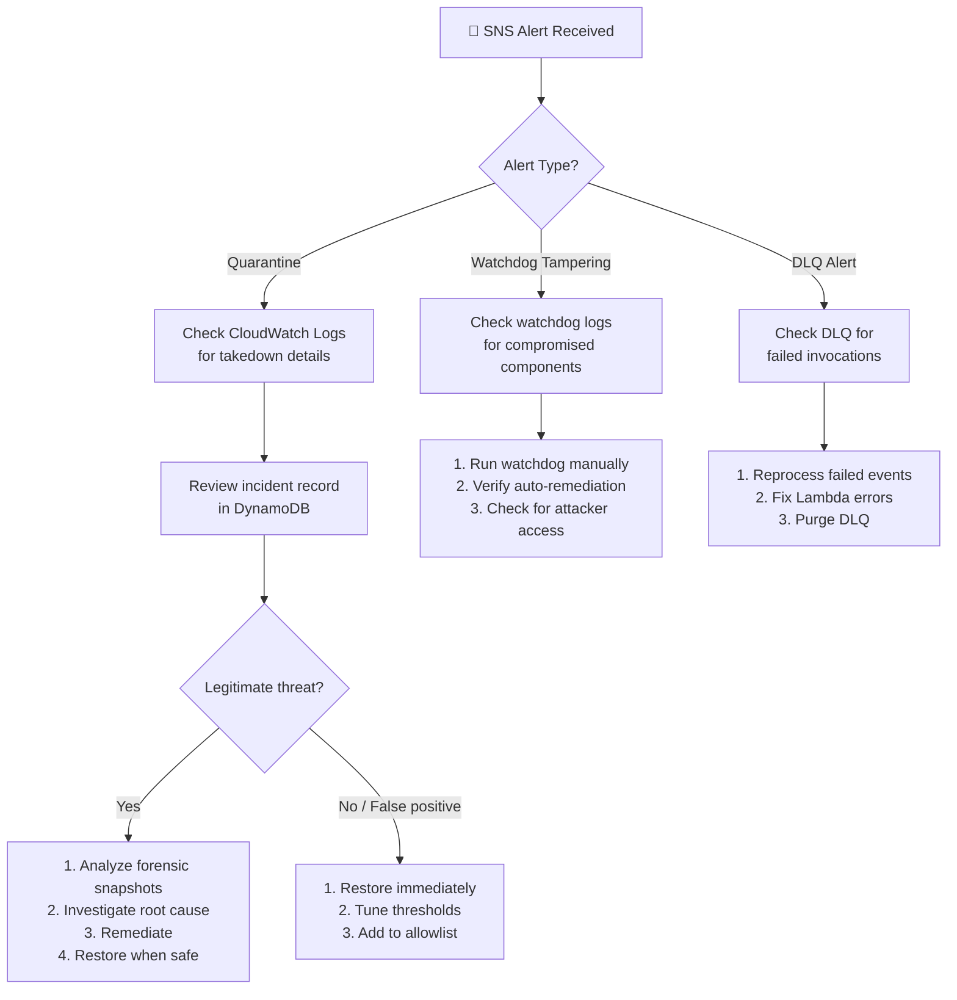

# CloudFreeze v7 — Deployment Guide

> **Estimated deployment time:** 10–15 minutes
> **AWS resources created:** ~70+ (VPC, subnets, Lambda ×4, DynamoDB ×2, S3 ×3, CloudTrail, GuardDuty, EventBridge ×10, IAM ×15+, SQS ×4, KMS, SNS, CloudWatch, SSM)
> **Monthly cost:** ~$29–30 (us-east-1, single monitored instance)

---

## Architecture Diagram

```mermaid
flowchart TB
    subgraph VPC["VPC 10.0.0.0/16"]
        subgraph PubA["Public Subnet A (10.0.1.0/24) — AZ a"]
            EC2["EC2 Target Instance\nt2.micro | Amazon Linux 2023\nCloudFreeze Agent (systemd)"]
        end
        subgraph PubB["Public Subnet B (10.0.2.0/24) — AZ b"]
            EC2B["(Multi-AZ Ready)"]
        end
        subgraph VPCE["VPC Endpoints (private)"]
            SSM_EP["ssm / ssmmessages / ec2messages"]
            CW_EP["monitoring / logs"]
            S3_EP["S3 Gateway"]
        end
        SG_NORMAL["SG: Normal\nSSH + HTTPS + ICMP ingress\nAll egress"]
        SG_QUARANTINE["SG: Quarantine\nNo ingress\nEgress → VPC endpoints ONLY"]
        NACL_Q["Quarantine NACL\nDENY ALL ingress/egress"]
    end

    subgraph DetectionLayer["Detection Layer"]
        CT["CloudTrail\n(multi-region + S3 data events)"]
        GD["GuardDuty\n(ML + malware scan)"]
        S3HT["S3 Honeytoken Bucket\n(000_database_passwords.csv)"]
        AGENT["Instance Agent\n(systemd + watchdog)"]
        CWA["CloudWatch Alarms\n(CPU, DiskIO, AgentHeartbeat)"]
    end

    subgraph EventRouting["EventBridge Rules"]
        EB_KMS["KMS Encrypt"]
        EB_KMSF["KMS Foreign Key"]
        EB_KMSR["KMS Rate Alarm"]
        EB_HT["Honeytoken Access"]
        EB_VEL["Velocity Alarms"]
        EB_GD["GuardDuty Findings"]
        EB_S3["S3 Bulk Ops"]
        EB_RDS["RDS Protection"]
        EB_SD["Self-Defense"]
        EB_SCHED["Watchdog Schedule\n(every 5 min)"]
    end

    subgraph ResponseEngine["Response Engine"]
        L_KS["Kill-Switch Lambda\n256MB | 60s | Prov.Concur.\nPython 3.12"]
        L_FR["Forensic Lambda\n256MB | 300s\nEBS snapshots + SSM memory"]
        L_RS["Restore Lambda\n256MB | 60s\nManual rollback"]
        L_WD["Watchdog Lambda\n128MB | 60s\nIntegrity checks"]
        DDB_INC["DynamoDB: incidents\nIdempotency locks\nPAY_PER_REQUEST | TTL 24h"]
        DDB_KMS["DynamoDB: kms-rate\nAtomic counters\nPAY_PER_REQUEST | TTL auto"]
        DLQ_KS["SQS DLQ: killswitch\n14-day retention"]
        DLQ_RS["SQS DLQ: restore"]
        DLQ_FR["SQS DLQ: forensic"]
        DLQ_WD["SQS DLQ: watchdog"]
    end

    subgraph Alerting["Alerting & Observability"]
        SNS["SNS Topic\n(email subscription)"]
        DASH["CloudWatch Dashboard\nLambda metrics, DLQs, alarms"]
        KMS_KEY["KMS Key\n(auto-rotation)\nForensic snapshot encryption"]
    end

    CT --> EB_KMS & EB_KMSF & EB_S3 & EB_RDS & EB_SD
    GD --> EB_GD
    S3HT -->|S3 Event Notification| L_KS
    AGENT -->|Direct SDK invoke| L_KS
    CWA --> EB_VEL & EB_KMSR

    EB_KMS & EB_KMSF & EB_KMSR & EB_HT & EB_VEL & EB_GD & EB_S3 & EB_RDS --> L_KS
    EB_SD --> SNS
    EB_SCHED --> L_WD

    L_KS --> DDB_INC & DDB_KMS
    L_KS -.->|failures| DLQ_KS
    L_KS -->|async invoke| L_FR
    L_KS --> SNS
    L_FR -.->|failures| DLQ_FR
    L_RS -.->|failures| DLQ_RS
    L_WD -.->|failures| DLQ_WD
    L_WD --> SNS

    L_KS -->|Phase 1| SG_QUARANTINE
    L_KS -->|Phase 4| NACL_Q
    L_FR --> KMS_KEY
```



---

## Detection Latency Reference

| Channel | Detection Source | Latency | Cost Contribution |
|---------|-----------------|---------|-------------------|
| S3 Honeytoken | S3 Event Notification → Lambda | < 1 second | Free (S3 events) |
| Instance Agent (CPU/Disk/Canary/Entropy) | systemd service → Direct SDK invoke | 1-5 seconds | Free (SSM association) |
| GuardDuty ML | AWS ML → EventBridge → Lambda | 2-10 seconds | ~$4/mo (volume-based) |
| ECS Task Events | EventBridge → Lambda | 5-15 seconds | Free (EventBridge) |
| KMS Rate Counter | CloudTrail → EventBridge → Lambda → DDB | 10-30 seconds | ~$0.25/mo (DDB) |
| KMS Foreign Key Detection | CloudTrail → EventBridge → Lambda | 10-30 seconds | Included in CloudTrail |
| S3 Bulk Operations | CloudTrail → EventBridge → Lambda → DDB | 10-30 seconds | Included in CloudTrail |
| RDS Protection | CloudTrail → EventBridge → Lambda | 10-30 seconds | Included in CloudTrail |
| Velocity CloudWatch Alarms | CW Metrics → CW Alarm → EventBridge | 30s-2 min | ~$0.30/mo (3 alarms) |

---

## Prerequisites

| Requirement | Version | Purpose |
|-------------|---------|---------|
| AWS Account | — | Resources will be deployed here |
| AWS CLI | v2.x | Authentication + resource management |
| Terraform | ≥ 1.3 | Infrastructure-as-Code engine |
| Python | 3.12 | Lambda runtime + local testing |
| Make | ≥ 3.8 | Build automation (optional — can run commands manually) |
| pip | ≥ 21 | Python package management |
| zip | any | Lambda packaging (`make package`) |

### AWS Permissions Required

The deploying IAM user/role needs these permissions (or `AdministratorAccess` for initial setup):

```
ec2:*       lambda:*      iam:*         dynamodb:*    s3:*
sns:*       sqs:*         kms:*         logs:*        events:*
cloudtrail:*  guardduty:*   ssm:*         sts:*         cloudwatch:*
ecs:*
```

---

## Step 1: Clone & Configure

```bash
# Clone or navigate to the project
cd CloudFreeze

# Copy the example config
cp terraform.tfvars.example terraform.tfvars
```

Edit `terraform.tfvars` with your values:

```hcl
# REQUIRED — Your email for security alerts
alert_email = "your-soc-team@company.com"

# AWS region (default: us-east-1)
aws_region = "us-east-1"

# SSH access — must be your IP, NOT 0.0.0.0/0 (validation will reject it)
allowed_ssh_cidr = "YOUR.IP.HERE/32"

# ── Tuning (optional — defaults are good for most workloads) ──

# KMS rate alarm threshold (calls/minute before quarantine)
# kms_call_threshold = 50

# CPU utilization threshold for velocity alarm
# cpu_threshold = 90

# Disk write operations threshold per minute
# disk_write_threshold = 1000

# GuardDuty — set to false if already enabled in your account
# enable_guardduty = true

# Memory forensics — requires avml on instances
# enable_memory_forensics = false
```

### Variable Reference

| Variable | Type | Default | Validation | Description |
|----------|------|---------|-----------|-------------|
| `alert_email` | string | *required* | — | Email for SNS security alerts |
| `aws_region` | string | `us-east-1` | — | AWS region |
| `project_name` | string | `cloudfreeze` | — | Resource name prefix |
| `kms_call_threshold` | number | `50` | ≥ 10 | KMS Encrypt calls/min before alarm |
| `disk_write_threshold` | number | `1000` | ≥ 100 | Disk write ops/min before alarm |
| `cpu_threshold` | number | `90` | 1–100 | CPU % before alarm |
| `allowed_ssh_cidr` | string | `10.0.0.0/32` | ≠ `0.0.0.0/0` | SSH CIDR (must be your IP) |
| `enable_guardduty` | bool | `true` | — | Enable GuardDuty (false if account-wide) |
| `enable_memory_forensics` | bool | `false` | — | Enable SSM-based memory capture |
| `instance_type` | string | `t3.micro` | — | EC2 instance type |
| `instance_count` | number | `1` | 1–10 | Number of monitored instances |
| `log_retention_days` | number | `30` | CW valid values | CloudWatch log retention |
| `file_change_rate_threshold` | number | `20` | 5–500 | File modifications/min (slow encryption) |
| `s3_bulk_ops_threshold` | number | `50` | 10–1000 | S3 bulk ops/min/principal |
| `watchdog_interval_minutes` | number | `5` | 1–60 | Watchdog run frequency |

---

## Step 2: Package Lambda Functions

Each Lambda function is packaged with `utils.py` (shared utilities: retry decorator, circuit breaker, NACL hash, entropy calculator):

```bash
make package
```

This creates:
```
lambda/
├── lambda_function.zip    # Kill-Switch (lambda_function.py + utils.py)
├── lambda_forensic.zip    # Forensic (lambda_forensic.py + utils.py)
├── lambda_restore.zip     # Restore (lambda_restore.py + utils.py)
└── lambda_watchdog.zip    # Watchdog (lambda_watchdog.py + utils.py)
```

**Why `utils.py` is in every ZIP:** Each Lambda runs in its own isolated container. Shared code (retry decorator, circuit breaker, JSON logging) must be bundled into each deployment package. Terraform's `source_code_hash` detects changes and auto-redeploys.

---

## Step 3: Deploy with Terraform

```bash
# Initialize Terraform providers
terraform init

# Preview what will be created (~70+ resources)
terraform plan

# Deploy everything
terraform apply
```

### What Gets Created (Full Resource List)

| # | Resource Type | Name | Purpose |
|---|--------------|------|---------|
| 1 | VPC | `cloudfreeze-vpc` | Isolated network (10.0.0.0/16) |
| 2 | Internet Gateway | `cloudfreeze-igw` | Public internet access |
| 3 | Public Subnet A | `cloudfreeze-public-a` | Primary AZ (10.0.1.0/24) |
| 4 | Public Subnet B | `cloudfreeze-public-b` | Multi-AZ (10.0.2.0/24) |
| 5 | Route Table | `cloudfreeze-public-rt` | Default route → IGW |
| 6 | Security Group (Normal) | `cloudfreeze-normal` | Standard access rules |
| 7 | Security Group (Quarantine) | `cloudfreeze-quarantine` | VPC-endpoint-only egress |
| 8 | Network ACL (Quarantine) | `cloudfreeze-quarantine-nacl` | DENY ALL rules |
| 9 | VPC Endpoint (SSM) | `cloudfreeze-ssm-vpce` | Session Manager in quarantine |
| 10 | VPC Endpoint (SSM Messages) | `cloudfreeze-ssmmessages-vpce` | SSM channel in quarantine |
| 11 | VPC Endpoint (EC2 Messages) | `cloudfreeze-ec2messages-vpce` | SSM channel in quarantine |
| 12 | VPC Endpoint (CW Monitoring) | `cloudfreeze-monitoring-vpce` | Metrics in quarantine |
| 13 | VPC Endpoint (CW Logs) | `cloudfreeze-logs-vpce` | Logs in quarantine |
| 14 | VPC Endpoint (S3 Gateway) | `cloudfreeze-s3-vpce` | S3 access in quarantine |
| 15 | EC2 Instance | `cloudfreeze-target` | Monitored instance |
| 16 | IAM Role (Lambda Kill-Switch) | `cloudfreeze-lambda-role` | Quarantine permissions |
| 17 | IAM Role (Lambda Forensic) | `cloudfreeze-lambda-forensic-role` | Snapshot permissions |
| 18 | IAM Role (Lambda Restore) | `cloudfreeze-lambda-restore-role` | Rollback permissions |
| 19 | IAM Role (Lambda Watchdog) | `cloudfreeze-lambda-watchdog-role` | Integrity check permissions |
| 20 | IAM Role (EC2 Instance) | `cloudfreeze-ec2-role` | SSM + CW agent permissions |
| 21 | Lambda (Kill-Switch) | `cloudfreeze-killswitch` | Core quarantine engine |
| 22 | Lambda (Forensic) | `cloudfreeze-forensic` | Async snapshot + memory |
| 23 | Lambda (Restore) | `cloudfreeze-restore` | Rollback quarantine |
| 24 | Lambda (Watchdog) | `cloudfreeze-watchdog` | Infrastructure integrity |
| 25 | S3 Bucket (Honeytoken) | `cloudfreeze-honeytoken-*` | Decoy credentials trap |
| 26 | S3 Bucket (CloudTrail Logs) | `cloudfreeze-cloudtrail-*` | API audit trail storage |
| 27 | S3 Bucket (Forensic Data) | `cloudfreeze-forensic-data-*` | Memory dumps + volatile data |
| 28 | DynamoDB Table (Incidents) | `cloudfreeze-incidents` | Idempotency locks + results |
| 29 | DynamoDB Table (KMS Rate) | `cloudfreeze-kms-rate` | Atomic rate counters |
| 30 | KMS Key | `cloudfreeze-forensic-key` | Snapshot encryption (auto-rotate) |
| 31 | SNS Topic | `cloudfreeze-alerts` | Email notifications |
| 32 | CloudTrail | `cloudfreeze-trail` | Multi-region management events |
| 33 | GuardDuty Detector | `cloudfreeze-guardduty` | ML threat detection |
| 34-42 | EventBridge Rules × 9 | Various | Detection routing |
| 43-46 | SQS DLQs × 4 | Various | Failed invocation capture |
| 47-55 | CloudWatch Alarms × 9 | Various | Metric-based alerting |
| 56 | CloudWatch Dashboard | `cloudfreeze-defense-dashboard` | Health monitoring UI |
| 57 | SSM Document | `cloudfreeze-realtime-monitor` | Instance agent deployment |
| 58 | SSM Association | Target tag: `CloudFreeze=monitored` | Auto-deploy agent |
| 59-60 | SSM Parameters × 2 | Canary checksums + Lambda hashes | Tamper-proof verification |
| 61+ | IAM Policies × 15+ | Least-privilege | Service-specific access |

---

## Step 4: Confirm SNS Subscription

After `terraform apply`, check your email for a **subscription confirmation** from AWS SNS. You **must click the confirmation link** to receive security alerts.

```bash
# Verify subscription status
aws sns list-subscriptions-by-topic --topic-arn $(terraform output -raw sns_topic_arn)
```

---

## Step 5: Verify Deployment

### Quick Health Check

```bash
# Verify all key resources exist
echo "=== CloudFreeze v7 Health Check ==="
echo "Instance:         $(terraform output -raw target_instance_id)"
echo "Quarantine SG:    $(terraform output -raw quarantine_sg_id)"
echo "Quarantine NACL:  $(terraform output -raw quarantine_nacl_id)"
echo "Kill-Switch ARN:  $(terraform output -raw lambda_killswitch_arn)"
echo "Forensic ARN:     $(terraform output -raw forensic_lambda_arn)"
echo "Watchdog ARN:     $(terraform output -raw watchdog_lambda_arn)"
echo "SNS Topic:        $(terraform output -raw sns_topic_arn)"
echo "Dashboard:        $(terraform output -raw dashboard_url)"
echo "DynamoDB:         $(terraform output -raw dynamodb_table)"
echo "KMS Rate Table:   $(terraform output -raw kms_rate_table)"
```

### Instance Agent Verification

```bash
# Connect to the instance via SSM (no SSH needed)
aws ssm start-session --target $(terraform output -raw target_instance_id)

# Once connected:
sudo systemctl status cloudfreeze-monitor     # Should show "active (running)"
sudo systemctl status cloudfreeze-watchdog     # Should show "active (running)"
tail -20 /var/log/cloudfreeze-monitor.log      # Should show check entries
```

---

## Step 6: Live Tripwire Testing

### Test 1: S3 Honeytoken Trigger (< 1 second response)

```bash
# This triggers the honeytoken detector — the FASTEST detection channel
BUCKET=$(terraform output -raw honeytoken_bucket)
aws s3api get-object --bucket "$BUCKET" --key "000_database_passwords.csv" /tmp/test-honey.txt

# Expected within 1-3 seconds:
# ✅ SNS email alert: "CloudFreeze ALERT: S3 Honeytoken Accessed"
# ✅ Kill-Switch Lambda invoked
# ✅ If accessed from an EC2 role → instance quarantined
# ✅ If accessed from an IAM user → deny-all policy applied
```

### Test 2: Direct Kill-Switch Invocation (Instance Agent Simulation)

```bash
INSTANCE_ID=$(terraform output -raw target_instance_id)
LAMBDA_ARN=$(terraform output -raw lambda_killswitch_arn)

# Simulate an instance agent CPU-spike alert
aws lambda invoke \
  --function-name "$LAMBDA_ARN" \
  --payload '{
    "source": "instance-agent",
    "instance_id": "'$INSTANCE_ID'",
    "alert_type": "cpu-spike",
    "detail": "CPU at 95% (threshold: 90%)",
    "timestamp": "'$(date -u +%Y-%m-%dT%H:%M:%SZ)'"
  }' \
  --cli-binary-format raw-in-base64-out \
  /tmp/killswitch-response.json

cat /tmp/killswitch-response.json
```

### Test 3: Verify Instance Was Quarantined

```bash
INSTANCE_ID=$(terraform output -raw target_instance_id)
QUARANTINE_SG=$(terraform output -raw quarantine_sg_id)

# Check current Security Groups — should show ONLY the quarantine SG
aws ec2 describe-instances \
  --instance-ids "$INSTANCE_ID" \
  --query 'Reservations[0].Instances[0].SecurityGroups' \
  --output table

# Expected output:
# +--------------------------------------+--------------------+
# |               GroupId                |     GroupName      |
# +--------------------------------------+--------------------+
# |  sg-xxxxxxxxxxxxxxxxx               |  cloudfreeze-quarantine  |
# +--------------------------------------+--------------------+

# Check IAM Instance Profile — should be detached
aws ec2 describe-instances \
  --instance-ids "$INSTANCE_ID" \
  --query 'Reservations[0].Instances[0].IamInstanceProfile' \
  --output text
# Expected: None
```

### Test 4: Verify DynamoDB Incident Record

```bash
TABLE=$(terraform output -raw dynamodb_table)

aws dynamodb scan \
  --table-name "$TABLE" \
  --filter-expression "target_id = :id" \
  --expression-attribute-values '{":id": {"S": "'$INSTANCE_ID'"}}' \
  --output json | python3 -m json.tool
```

### Test 5: Watchdog Integrity Check

```bash
# Manually invoke the watchdog to verify infrastructure
WATCHDOG_ARN=$(terraform output -raw watchdog_lambda_arn)

aws lambda invoke \
  --function-name "$WATCHDOG_ARN" \
  --payload '{}' \
  --cli-binary-format raw-in-base64-out \
  /tmp/watchdog-response.json

cat /tmp/watchdog-response.json | python3 -m json.tool

# Expected: All checks "HEALTHY"
# {
#   "checks": {
#     "eventbridge_rules": {"status": "HEALTHY"},
#     "lambda_functions": {"status": "HEALTHY"},
#     "dynamodb_tables": {"status": "HEALTHY"},
#     "quarantine_sg": {"status": "HEALTHY"},
#     "iam_permissions": {"status": "HEALTHY"}
#   },
#   "overall_status": "HEALTHY",
#   "issues_found": 0
# }
```

---

## Step 7: Restore (Un-Quarantine)

After forensic investigation is complete, restore the instance:

```bash
RESTORE_ARN=$(terraform output -raw lambda_restore_arn)
INSTANCE_ID=$(terraform output -raw target_instance_id)

aws lambda invoke \
  --function-name "$RESTORE_ARN" \
  --payload '{"instance_id": "'$INSTANCE_ID'"}' \
  --cli-binary-format raw-in-base64-out \
  /tmp/restore-response.json

cat /tmp/restore-response.json | python3 -m json.tool
```

### Restore Process Details

The Restore Lambda performs these actions:

1. **Reads incident record** from DynamoDB — verifies status is `COMPLETED` (refuses if `IN_PROGRESS`)
2. **Restores Security Groups** — swaps quarantine SG back to original SGs on every ENI (validates original SGs still exist)
3. **Restores IAM Profile** — re-associates the detached instance profile
4. **Restores NACL** — removes per-IP deny rules or swaps back to original NACL
5. **Updates incident record** → status `RESTORED`
6. **Sends SNS notification** — "✅ CloudFreeze RESTORE: i-xxxxx"

### For IAM Entity Restore

```bash
aws lambda invoke \
  --function-name "$RESTORE_ARN" \
  --payload '{"iam_arn": "arn:aws:iam::123456789012:user/compromised-user"}' \
  --cli-binary-format raw-in-base64-out \
  /tmp/iam-restore-response.json
```

This removes:
- `CloudFreeze-EmergencyDenyAll` inline policy
- `CloudFreeze-RevokeOldSessions` inline policy

---

## Monitoring Dashboard

Access the CloudWatch dashboard:

```bash
# Print the dashboard URL
terraform output dashboard_url
```

### Dashboard Widgets

| Widget | Shows | Alert Threshold |
|--------|-------|----------------|
| **Kill-Switch Invocations & Errors** | Lambda invocation count, error count, throttles | Error count > 0 → alarm |
| **Kill-Switch Duration (ms)** | Average and p99 execution time | p99 > 60,000ms → investigate |
| **DLQ Depth** | Failed invocations in kill-switch and restore DLQs | DLQ messages > 0 → alarm |
| **KMS Encrypt Call Rate** | KMS encrypt operations per minute | Exceeds `kms_call_threshold` → quarantine |
| **Alarm Status** | All velocity and rate alarms in one view | Any ALARM state → investigate |

---

## CloudWatch Logs & Debugging

### Log Groups

All Lambda functions emit structured JSON logs to CloudWatch:

```bash
# Kill-Switch logs
aws logs tail /aws/lambda/cloudfreeze-killswitch --follow --format short

# Forensic logs
aws logs tail /aws/lambda/cloudfreeze-forensic --follow --format short

# Watchdog logs
aws logs tail /aws/lambda/cloudfreeze-watchdog --follow --format short

# Instance agent logs (on the instance via SSM)
aws ssm start-session --target $(terraform output -raw target_instance_id)
# Then: tail -f /var/log/cloudfreeze-monitor.log
```

### CloudWatch Insights Queries

```sql
-- Find all quarantine actions in the last 24h
fields @timestamp, @message
| filter @message like /QUARANTINE/
| sort @timestamp desc
| limit 50

-- Find all circuit breaker trips
fields @timestamp, @message
| filter @message like /Circuit breaker tripped/
| sort @timestamp desc

-- Find all SNS rate limiting events
fields @timestamp, @message
| filter @message like /SNS rate limited/
| sort @timestamp desc
```

---

## Operational Runbook

### Incident Response Workflow



### Common Operations

| Task | Command |
|------|---------|
| **Check instance SGs** | `aws ec2 describe-instances --instance-ids $ID --query 'Reservations[0].Instances[0].SecurityGroups'` |
| **Check DynamoDB incidents** | `aws dynamodb scan --table-name cloudfreeze-incidents` |
| **Invoke watchdog manually** | `aws lambda invoke --function-name cloudfreeze-watchdog --payload '{}' /tmp/out.json` |
| **Check DLQ depth** | `aws sqs get-queue-attributes --queue-url $DLQ_URL --attribute-names ApproximateNumberOfMessages` |
| **View forensic snapshots** | `aws ec2 describe-snapshots --filters "Name=tag:CloudFreeze,Values=forensic-snapshot"` |
| **Re-deploy Lambda code** | `make package && terraform apply` |
| **Update thresholds** | Edit `terraform.tfvars` → `terraform apply` |

---

## Threshold Tuning Guide

### When to Increase Thresholds (Reduce False Positives)

| Scenario | Variable to Tune | Direction |
|----------|-----------------|-----------|
| Legitimate KMS-heavy workloads (encryption at rest) | `kms_call_threshold` | Increase (e.g., 100-500) |
| CI/CD pipelines with high disk I/O | `disk_write_threshold` | Increase (e.g., 5000) |
| Batch processing jobs with high CPU | `cpu_threshold` | Increase (e.g., 95) |
| Applications doing bulk S3 uploads | `s3_bulk_ops_threshold` | Increase (e.g., 200) |
| Build systems with high file churn | `file_change_rate_threshold` | Increase (e.g., 100) |

### When to Decrease Thresholds (Tighter Security)

| Scenario | Variable to Tune | Direction |
|----------|-----------------|-----------|
| Low-traffic database servers | `kms_call_threshold` | Decrease (e.g., 20) |
| Static file servers | `disk_write_threshold` | Decrease (e.g., 200) |
| Web servers (should be I/O-light) | `cpu_threshold` | Decrease (e.g., 80) |

---

## Testing (Zero AWS Cost)

Run the full test suite locally using moto (AWS mock library):

```bash
# Install test dependencies
pip install -r requirements-dev.txt

# Run all tests
make test
# or:
python -m pytest tests/ -v --tb=short

# Run a specific test file
python -m pytest tests/test_lambda_function.py -v

# Run with coverage
python -m pytest tests/ -v --cov=lambda --cov-report=term-missing
```

All tests use `moto` to mock AWS services — **zero API calls, zero cost, full test coverage**.

---

## Cleanup (Destroy Everything)

```bash
# Remove all CloudFreeze resources
terraform destroy

# Clean up Lambda ZIP files
make clean
```

> **⚠️ Warning:** This permanently deletes all resources including forensic snapshots, CloudTrail logs, and DynamoDB incident records. Export forensic data before destruction if needed.

### Partial Cleanup (Keep Forensic Data)

```bash
# Before destroying, download forensic snapshots
aws ec2 describe-snapshots \
  --filters "Name=tag:CloudFreeze,Values=forensic-snapshot" \
  --query 'Snapshots[*].[SnapshotId,Description]' --output table

# Copy forensic S3 data locally
aws s3 sync s3://$(terraform output -raw forensic_s3_bucket) ./forensic-backup/

# Then destroy
terraform destroy
```

---

## Security Hardening Checklist

- [ ] Set `allowed_ssh_cidr` to your specific IP (validation rejects `0.0.0.0/0`)
- [ ] Confirm SNS email subscription (check spam folder)
- [ ] Verify instance agent is running (`systemctl status cloudfreeze-monitor`)
- [ ] Run watchdog manually and verify all checks HEALTHY
- [ ] Review IAM policies — all follow least-privilege
- [ ] Enable `enable_memory_forensics = true` if you have avml on instances
- [ ] Set `enable_guardduty = false` if already enabled account-wide
- [ ] Review S3 bucket policies — all have `block_public_access` enabled
- [ ] Verify EBS encryption — all volumes encrypted by default
- [ ] Verify KMS key rotation — enabled (1-year automatic rotation)
- [ ] Test the honeytoken (Step 6, Test 1) and verify response
- [ ] Test restore flow (Step 7) to confirm rollback works
- [ ] Bookmark the CloudWatch dashboard URL
